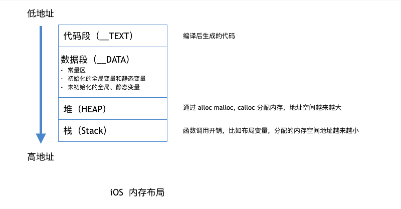

### 打印内存地址

```objective-c
void test() {
    NSString *str = @"123";
    NSObject *obj = [[NSObject alloc] init];
    
    int c = 12;
    int d = 14;
    NSLog(@"num %p",num);
    NSLog(@"a %p",&a);
    NSLog(@"b %p",&b);
    NSLog(@"str %p",str);
    NSLog(@"obj %p",obj);
    NSLog(@"c %p",&c);
    NSLog(@"d %p",&d);
}

/*
 num    0x0
 a      0x10fd74e58     // 已初始化的静态变量
 b      0x10fd74f28    //未初始化的全局变量
 str    0x10fd74068    // 常量区
 
 obj    0x600000680990 //堆
 
 c      0x7ffedfe8a83c // 栈
 d      0x7ffedfe8a838
 */
```




