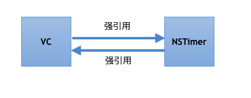
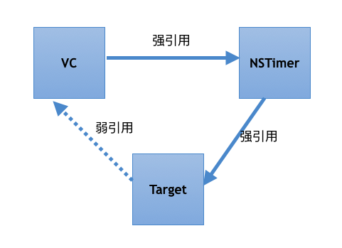

### **NSTimer** 注意事项

CADisplayLink、NSTimer 会对target产生强引用，如果target又对它们产生强引用，那么就会引发循环引用



解决方案：

1. 封装Block方法

```objective-c
__weak typeof(self) weakSelf = self;
    _timer = [NSTimer yy_timerWithTimeInterval:2 repeats:YES block:^(NSTimer * _Nonnull timer) {
        __strong typeof(weakSelf) strongSelf = weakSelf;
        NSLog(@"%@",strongSelf.timer);
    }];
}
```


2. 转移NSTimer对Target的强引用

   

```objective-c
@interface YYTimerBlockTarget : NSObject

@property (nonatomic, assign, readonly) SEL selector;
@property (nonatomic, weak, readonly) id target;
@property (nonatomic, weak) NSTimer *timer;

-(instancetype)initWithTarget:(id)aTarget selector:(SEL)aSelector;

- (void)invoke:(NSTimer *)timer;

@end

@implementation YYTimerBlockTarget

- (instancetype)initWithTarget:(id)aTarget selector:(SEL)aSelector {
    self = [super init];
    if (self) {
        _target = aTarget;
        _selector = aSelector;
    }
    return self;
}

- (void)invoke:(NSTimer *)timer {
    NSLog(@"_target->%@",_target);
    if ([_target respondsToSelector:_selector]) {
#pragma clang diagnostic push
#pragma clang diagnostic ignored "-Warc-performSelector-leaks"
          [_target performSelector:_selector withObject:timer];
#pragma clang diagnostic pop
    } else {
        // 防止外部自己没有关闭定时器
        NSLog(@"[_timer invalidate]");
        [_timer invalidate];
    }
}

- (void)dealloc {
    NSLog(@"%s",__func__);
}

@end

@implementation YYTimerUtil

+ (NSTimer *)scheduledTimerWithTimeInterval:(NSTimeInterval)ti target:(id)aTarget selector:(SEL)aSelector userInfo:(id)userInfo repeats:(BOOL)yesOrNo {
    YYTimerBlockTarget *timerBlock = [[YYTimerBlockTarget alloc] initWithTarget:aTarget selector:aSelector];
    NSTimer *timer = [NSTimer scheduledTimerWithTimeInterval:ti target:timerBlock selector:@selector(invoke:) userInfo:userInfo repeats:yesOrNo];
    timerBlock.timer = timer;
    return timer;
}

@end

```

3. 使用代理对象 NSProxy

```objective-c
@implementation YYProxy

+ (instancetype)proxyWithTarget:(id)target {
    YYProxy *proxy = [YYProxy alloc];
    proxy->_target = target;
    return proxy;
}

- (NSMethodSignature *)methodSignatureForSelector:(SEL)sel {
    return [_target methodSignatureForSelector:sel];
}

- (void)forwardInvocation:(NSInvocation *)invocation {
    [invocation invokeWithTarget:_target];
}

- (void)dealloc {
    NSLog(@"%s",__func__);
}
@end
```

```objective-c

_timer = [NSTimer timerWithTimeInterval:1 target:[YYProxy proxyWithTarget:self] selector:@selector(doTask:) userInfo:@"world" repeats:YES];
    
[[NSRunLoop currentRunLoop] addTimer:_timer forMode:NSDefaultRunLoopMode];
```

4. 因为NSTimer 是依赖NSRunloop，如果当前线程的Runloop任务过多，可能会导致定时器不准确。

   可以使用 **dispatch_source_t timer**

```objective-c
dispatch_source_t timer = dispatch_source_create(DISPATCH_SOURCE_TYPE_TIMER, 0, 0, targetQueue);
dispatch_source_set_timer(timer, DISPATCH_TIME_NOW, start * NSEC_PER_SEC, interval * NSEC_PER_SEC);
    dispatch_source_set_event_handler(timer, ^{
        block(userInfo);
        if (!repeats) {
            [self cancelTimerWithID:taskID];
        }
});
dispatch_resume(timer);
```


> [Demo](https://github.com/fenglin9102/MemoryManagement/tree/master/TimerDemo)


